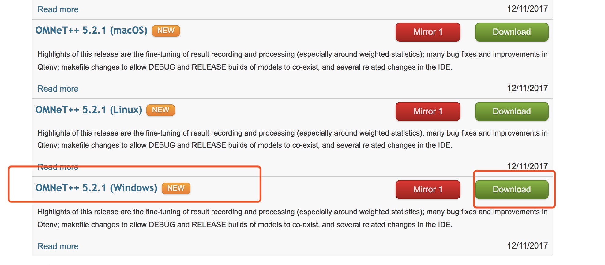
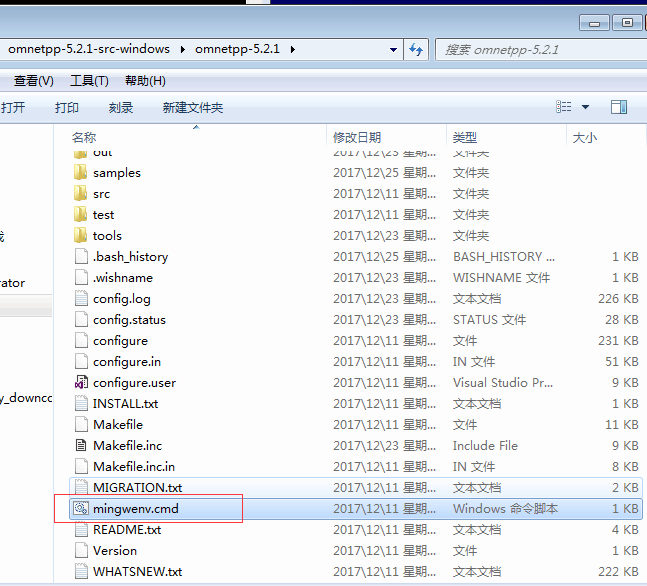
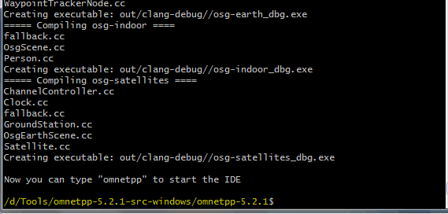
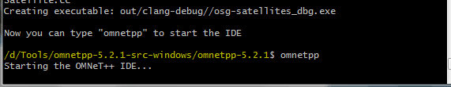
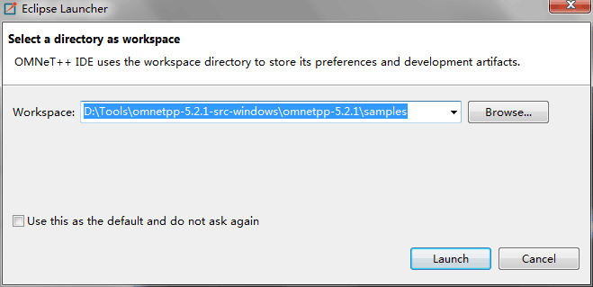
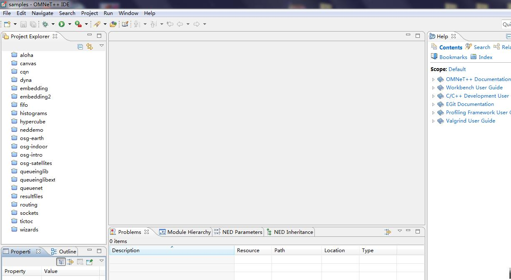

>登录`OMNeT++`官网下载对应的`windos`版本, 官网地址[点击这里](https://www.omnetpp.org/omnetpp)点击对应的连接进行下在 

<!-- more -->

>下载之后，用压缩文件进行解压到本地文件下，进入`omnet++`根目录，找到下面这个文件  
  

  
>双击上面的文件，进入到`shell`环境下面  
  

  
>在命令行中输入`./configure`  
  

  
>第五步完成之后继续输入`make`,这个过程有点长，需要耐心一段时间。  
  

  
>第六步完成之后会出现下面这样的结果  
  

  
>接下来我们根据提示输入对应的命令，启动我们的编译环境  
  

  
>启动之后，会提示你选择一个工作目录，这里用默认的目录就可以  
  

   
>之后就会进入环境的主页面，如下  
  

